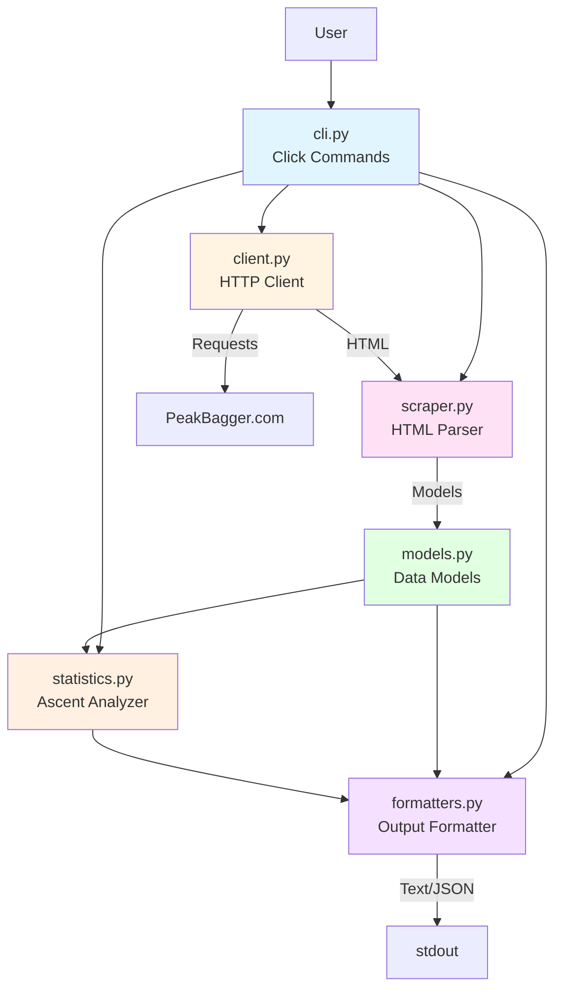
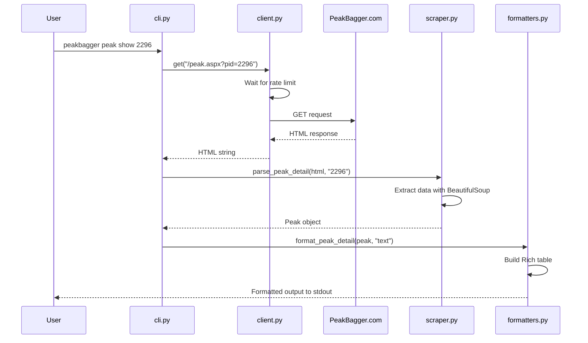

# Contributing to peakbagger-cli

## Development Setup

### Prerequisites

- Python 3.12 or higher
- `uv` (recommended) or `pip`

### Using uv (Recommended)

```bash
# Install uv if you haven't already
curl -LsSf https://astral.sh/uv/install.sh | sh

# Set up the development environment
uv sync

# Run the CLI
uv run peakbagger --help
```

### Using pip

```bash
# Create a virtual environment
python3 -m venv .venv
source .venv/bin/activate  # On Windows: .venv\Scripts\activate

# Install in editable mode with dev dependencies
pip install -e ".[dev]"
```

## Project Structure

```text
peakbagger-cli/
├── peakbagger/           # Main package
│   ├── __init__.py       # Package version and metadata
│   ├── cli.py            # Click CLI commands and main entry point
│   ├── client.py         # HTTP client with rate limiting
│   ├── scraper.py        # HTML parsing and data extraction
│   ├── models.py         # Data models (Peak, SearchResult, Ascent)
│   ├── formatters.py     # Output formatting (Rich tables, JSON)
│   ├── statistics.py     # Ascent statistics calculation
│   └── logging_config.py # Logging configuration with loguru
├── tests/                # Test suite
├── examples/             # Example scripts
├── pyproject.toml        # Project configuration and dependencies
└── .pre-commit-config.yaml  # Code quality hooks
```

### Module Responsibilities

- **cli.py**: Defines Click commands (`search`, `show`, `ascents`, `stats`), handles CLI arguments and options
- **client.py**: Manages HTTP requests with cloudscraper, implements rate limiting
- **scraper.py**: Parses HTML using BeautifulSoup, extracts peak and ascent data
- **models.py**: Defines data structures (Peak, SearchResult, Ascent, AscentStatistics) and serialization
- **formatters.py**: Formats output (Rich tables for humans, JSON for machines)
- **statistics.py**: Calculates temporal and seasonal statistics from ascent data
- **logging_config.py**: Configures loguru logger with different verbosity levels

## Architecture

### Component Diagram



### Data Flow

1. **User Input** → CLI parses command and options
2. **HTTP Request** → Client fetches HTML with rate limiting
3. **HTML Parsing** → Scraper extracts data into models
4. **Data Processing** → Analyzer calculates statistics (optional)
5. **Output Formatting** → Formatter renders as text or JSON
6. **Display** → Output printed to stdout/stderr

### Request/Response Flow Example



## Code Quality

### Formatting and Linting

```bash
# Format code
uv run ruff format peakbagger tests

# Lint and auto-fix issues
uv run ruff check --fix peakbagger tests

# Lint without fixing
uv run ruff check peakbagger tests
```

### Style Guidelines

- Use type hints for function parameters and return values
- Write docstrings for all public functions and classes
- Keep functions focused and small
- Use descriptive variable names

## Testing

```bash
# Run all tests
uv run pytest

# Run with coverage
uv run pytest --cov=peakbagger

# Test manually with real queries
uv run peakbagger search "Mount Rainier"
uv run peakbagger info 2296 --format json
```

## Development Tips

### Testing Against Real Website

Be respectful when testing against PeakBagger.com:

```bash
# Use increased rate limits during development
uv run peakbagger search "test" --rate-limit 5.0

# Test with well-known peaks that are unlikely to change
# Good: Mount Rainier (2296), Denali (271)
# Avoid: Obscure peaks that might not exist
```

### Working with HTML Parsing

When updating scraper logic:

1. Save sample HTML for testing:

   ```python
   response = client.get('/peak.aspx?pid=2296')
   with open('test_peak.html', 'w') as f:
       f.write(response)
   ```

2. Test parsing locally without network requests
3. Update tests with new HTML structure

## Developer Cookbook

This section provides step-by-step examples for common development tasks.

### Adding a New CLI Command

**Scenario**: Add a `peakbagger list show <list_id>` command to display peak lists.

**Step 1**: Add the data model in `models.py`

```python
class PeakList(BaseModel):
    """Represents a peak list with its metadata."""

    lid: str = Field(description="List ID")
    name: str = Field(description="List name")
    description: str | None = Field(None, description="List description")
    peak_count: int | None = Field(None, description="Number of peaks in list")

    def to_dict(self) -> dict[str, Any]:
        """Convert to dictionary for JSON serialization."""
        return {
            "lid": self.lid,
            "name": self.name,
            "description": self.description,
            "peak_count": self.peak_count,
            "url": f"https://www.peakbagger.com/list.aspx?lid={self.lid}",
        }
```

**Step 2**: Add the scraper method in `scraper.py`

```python
@staticmethod
def parse_list_detail(html: str, lid: str) -> PeakList | None:
    """
    Parse peak list details from list.aspx page.

    Args:
        html: HTML content from list detail page
        lid: List ID

    Returns:
        PeakList object with extracted data, or None if parsing fails
    """
    logger.debug(f"Parsing list detail for list ID {lid}")
    soup: BeautifulSoup = BeautifulSoup(html, "lxml")

    try:
        # Extract list name from H1
        h1: Tag | None = soup.find("h1")
        if not h1:
            return None

        name: str = h1.get_text(strip=True)

        # Extract description
        desc_tag = soup.find("div", class_="description")
        description = desc_tag.get_text(strip=True) if desc_tag else None

        # Count peaks in table
        table = soup.find("table", class_="gray")
        peak_count = len(table.find_all("tr")) - 1 if table else None  # Subtract header

        return PeakList(
            lid=lid,
            name=name,
            description=description,
            peak_count=peak_count,
        )

    except Exception:
        logger.exception("Error parsing list detail")
        return None
```

**Step 3**: Add the formatter method in `formatters.py`

```python
def format_list_detail(self, peak_list: PeakList, output_format: str = "text") -> None:
    """
    Format and print detailed list information.

    Args:
        peak_list: PeakList object
        output_format: Either 'text' or 'json'
    """
    if output_format == "json":
        self._print_json(peak_list.to_dict())
    else:
        # Title
        self.console.print(f"\n[bold cyan]{peak_list.name}[/bold cyan]")
        self.console.print(f"[dim]List ID: {peak_list.lid}[/dim]\n")

        # Create details table
        table: Table = Table(show_header=False, box=None, padding=(0, 2))
        table.add_column("Field", style="yellow", width=20)
        table.add_column("Value", style="white")

        if peak_list.description:
            table.add_row("Description", peak_list.description)

        if peak_list.peak_count:
            table.add_row("Peak Count", str(peak_list.peak_count))

        list_url = f"https://www.peakbagger.com/list.aspx?lid={peak_list.lid}"
        table.add_row("URL", f"[blue not underline]{list_url}[/blue not underline]")

        self.console.print(table)
```

**Step 4**: Add the CLI command in `cli.py`

```python
# Add a new command group after @main.group() for 'peak'
@main.group()
def list() -> None:
    """Commands for working with peak lists."""
    pass


@list.command("show")
@click.argument("list_id")
@click.option(
    "--format",
    "output_format",
    type=click.Choice(["text", "json"], case_sensitive=False),
    default="text",
    help="Output format (text or json)",
)
@click.option(
    "--rate-limit",
    type=float,
    default=2.0,
    help="Seconds between requests (default: 2.0)",
)
@click.pass_context
def show_list(ctx: click.Context, list_id: str, output_format: str, rate_limit: float) -> None:
    """
    Get detailed information about a specific peak list.

    LIST_ID: The PeakBagger list ID (e.g., "5030")

    Examples:

      peakbagger list show 5030

      peakbagger list show 5030 --format json
    """
    client: PeakBaggerClient = PeakBaggerClient(rate_limit_seconds=rate_limit)
    scraper: PeakBaggerScraper = PeakBaggerScraper()
    formatter: PeakFormatter = PeakFormatter()

    try:
        # Fetch list detail page
        html = client.get("/list.aspx", params={"lid": list_id})

        # If dump-html flag is set, print HTML and exit
        if ctx.obj.get("dump_html"):
            click.echo(html)
            return

        # Parse list data
        list_obj = scraper.parse_list_detail(html, list_id)

        if not list_obj:
            _error(f"Failed to parse list data for ID {list_id}")
            raise click.Abort()

        # Display results
        formatter.format_list_detail(list_obj, output_format)

    except Exception as e:
        _error(str(e))
        raise click.Abort() from e
    finally:
        client.close()
```

**Step 5**: Test the new command

```bash
# Test with real data
uv run peakbagger list show 5030

# Test JSON output
uv run peakbagger list show 5030 --format json

# Verify help text
uv run peakbagger list show --help
```

### Adding a New Scraper/Parser

**Scenario**: Add a parser for route details page (`route.aspx?rid=XXX`).

**Step 1**: Understand the HTML structure

```bash
# Save sample HTML for analysis
uv run peakbagger --dump-html peak show 2296 > sample_route.html

# Or manually fetch with curl
curl "https://www.peakbagger.com/route.aspx?rid=123" > sample_route.html
```

**Step 2**: Create the data model in `models.py`

```python
class Route(BaseModel):
    """Represents a climbing route."""

    rid: str = Field(description="Route ID")
    name: str = Field(description="Route name")
    peak_id: str | None = Field(None, description="Associated peak ID")
    difficulty: str | None = Field(None, description="Route difficulty/grade")
    trailhead: str | None = Field(None, description="Trailhead name")
    distance_mi: float | None = Field(None, description="Distance in miles")
    elevation_gain_ft: int | None = Field(None, description="Elevation gain in feet")

    def to_dict(self) -> dict[str, Any]:
        """Convert to dictionary for JSON serialization."""
        return {
            "rid": self.rid,
            "name": self.name,
            "peak_id": self.peak_id,
            "difficulty": self.difficulty,
            "trailhead": self.trailhead,
            "distance_mi": self.distance_mi,
            "elevation_gain_ft": self.elevation_gain_ft,
            "url": f"https://www.peakbagger.com/route.aspx?rid={self.rid}",
        }
```

**Step 3**: Add the parser method in `scraper.py`

```python
@staticmethod
def parse_route_detail(html: str, rid: str) -> Route | None:
    """
    Parse route details from route.aspx page.

    Args:
        html: HTML content from route detail page
        rid: Route ID

    Returns:
        Route object with extracted data, or None if parsing fails
    """
    logger.debug(f"Parsing route detail for route ID {rid}")
    soup: BeautifulSoup = BeautifulSoup(html, "lxml")

    try:
        # Extract route name from H1
        h1: Tag | None = soup.find("h1")
        if not h1:
            logger.debug("No H1 tag found in route detail page")
            return None

        name: str = h1.get_text(strip=True)

        # Initialize route object
        route: Route = Route(rid=rid, name=name)

        # Extract route details from table
        # Look for specific patterns in the HTML
        text: str = soup.get_text()

        # Extract distance
        distance_match = re.search(r"Distance.*?(\d+\.?\d*)\s*mi", text, re.IGNORECASE)
        if distance_match:
            route.distance_mi = float(distance_match.group(1))

        # Extract elevation gain
        gain_match = re.search(r"Gain.*?(\d+,?\d*)\s*ft", text, re.IGNORECASE)
        if gain_match:
            route.elevation_gain_ft = int(gain_match.group(1).replace(",", ""))

        # Extract difficulty/grade
        difficulty_match = re.search(r"Difficulty:?\s*([^\n<]+)", text)
        if difficulty_match:
            route.difficulty = difficulty_match.group(1).strip()

        logger.debug(f"Successfully parsed route detail for {name}")
        return route

    except Exception:
        logger.exception("Error parsing route detail")
        return None
```

**Step 4**: Add tests in `tests/test_scraper.py`

```python
def test_parse_route_detail():
    """Test parsing route detail page."""
    # Load sample HTML
    with open("tests/fixtures/sample_route.html") as f:
        html = f.read()

    scraper = PeakBaggerScraper()
    route = scraper.parse_route_detail(html, "123")

    assert route is not None
    assert route.rid == "123"
    assert route.name == "Disappointment Cleaver"
    assert route.distance_mi == 8.0
    assert route.elevation_gain_ft == 8986
```

**Step 5**: Handle edge cases

```python
# In your parser, handle missing data gracefully:

# Handle routes with no distance
if not distance_match:
    logger.debug("No distance found for route")
    route.distance_mi = None

# Handle different HTML structures
table = soup.find("table", class_="gray")
if table:
    # Extract from table
    pass
else:
    # Try alternative extraction method
    logger.debug("Using alternative extraction method")
```

### Adding Output Format Support

**Scenario**: Add CSV export for search results.

**Step 1**: Add CSV formatting method in `formatters.py`

```python
import csv
import sys

def format_search_results_csv(self, results: list[SearchResult]) -> None:
    """Format and print search results as CSV."""
    if not results:
        return

    # Write to stdout
    writer = csv.writer(sys.stdout)

    # Header
    writer.writerow(["Peak ID", "Name", "Location", "Range", "Elevation (ft)", "Elevation (m)", "URL"])

    # Data rows
    for result in results:
        writer.writerow([
            result.pid,
            result.name,
            result.location or "",
            result.range or "",
            result.elevation_ft or "",
            result.elevation_m or "",
            f"https://www.peakbagger.com/{result.url}",
        ])
```

**Step 2**: Update CLI command to support CSV format

```python
@peak.command()
@click.argument("query")
@click.option(
    "--format",
    "output_format",
    type=click.Choice(["text", "json", "csv"], case_sensitive=False),  # Add CSV
    default="text",
    help="Output format (text, json, or csv)",
)
def search(ctx: click.Context, query: str, output_format: str) -> None:
    # ... existing code ...

    if output_format == "csv":
        formatter.format_search_results_csv(results)
    elif output_format == "json":
        formatter.format_search_results(results, "json")
    else:
        formatter.format_search_results(results, "text")
```

**Step 3**: Test CSV output

```bash
# Test CSV output
uv run peakbagger peak search "Rainier" --format csv

# Redirect to file
uv run peakbagger peak search "Rainier" --format csv > results.csv
```

### Adding Filters and Options

**Scenario**: Add a `--min-elevation` filter to search results.

**Step 1**: Add the option to CLI command

```python
@peak.command()
@click.argument("query")
@click.option("--min-elevation", type=int, help="Minimum elevation in feet")
def search(ctx: click.Context, query: str, min_elevation: int | None) -> None:
    # ... fetch and parse results ...

    # Apply elevation filter
    if min_elevation:
        results = [r for r in results if r.elevation_ft and r.elevation_ft >= min_elevation]

    # ... format and display ...
```

**Step 2**: Update help text and examples

```python
"""
Search for peaks by name.

QUERY: Search term (e.g., "Mount Rainier", "Denali")

Examples:

  peakbagger peak search "Mount Rainier"

  peakbagger peak search "Denali" --min-elevation 10000

  peakbagger peak search "Whitney" --format json
"""
```

### Best Practices

1. **Always handle None values**: PeakBagger data is inconsistent

   ```python
   elevation = result.elevation_ft if result.elevation_ft else "Unknown"
   ```

2. **Use loguru for debugging**: Add logging to trace data extraction

   ```python
   logger.debug(f"Extracted {len(results)} search results")
   logger.debug(f"Peak name: {name}, elevation: {elevation_ft} ft")
   ```

3. **Test with real and edge cases**: Known peaks and obscure/malformed data

   ```bash
   # Good test cases:
   # - Mount Rainier (2296): Complete data, well-formatted
   # - Obscure peaks: May have missing fields
   # - Negative PIDs: Special/unlisted peaks
   ```

4. **Keep scrapers resilient**: HTML structure may change

   ```python
   try:
       elevation_ft = int(cell.get_text(strip=True).replace(",", ""))
   except (ValueError, AttributeError):
       elevation_ft = None  # Graceful fallback
   ```

5. **Follow the existing patterns**: Match code style in similar commands
   - Look at `peak show` when adding new detail commands
   - Look at `peak ascents` when adding list commands
   - Copy error handling and client usage patterns

## Release Process

### Automated Releases (Default)

**Releases are fully automated via GitHub Actions.** When commits are merged to the `main` branch:

1. GitHub Actions analyzes commit messages
2. If a release-triggering commit is found, the version is bumped automatically
3. CHANGELOG.md is updated
4. A Git tag and GitHub release are created

**No manual intervention needed** - just merge your PR with a conventional commit message.

### Commit Message Format

Follow the [Conventional Commits](https://www.conventionalcommits.org/) specification:

```text
<type>: <description>

[optional body]

[optional footer(s)]
```

**Types that trigger releases:**

- `fix:` - Patches a bug (PATCH version bump: 0.1.0 → 0.1.1)
- `feat:` - Adds a new feature (MINOR version bump: 0.1.0 → 0.2.0)
- `perf:` - Performance improvement (PATCH version bump)
- `BREAKING CHANGE:` in footer - Breaking change (MAJOR version bump: 0.1.0 → 1.0.0)

**Types that don't trigger releases:**

- `docs:`, `style:`, `refactor:`, `test:`, `chore:`, `ci:`, `build:`

**Examples:**

```bash
# Patch release (0.1.0 → 0.1.1)
git commit -m "fix: correct elevation parsing for peaks without prominence data"

# Minor release (0.1.0 → 0.2.0)
git commit -m "feat: add support for searching peaks by elevation range"

# Major release (0.1.0 → 1.0.0)
git commit -m "feat: redesign CLI interface

BREAKING CHANGE: The --full flag has been replaced with --detailed"
```

### Release Workflow Setup (For Maintainers)

The automated release workflow uses a **GitHub App** for authentication to bypass branch protection rules securely.

**Setup is already complete**, but if you need to configure this for a fork or new repository, see
[`.github/GITHUB_APP_SETUP.md`](.github/GITHUB_APP_SETUP.md) for detailed instructions on:

- Creating and configuring the GitHub App
- Setting up repository secrets
- Configuring repository rulesets

### PyPI Publishing (For Maintainers)

The project is configured to automatically publish to PyPI using **Trusted Publishing** (OIDC authentication).

#### One-Time PyPI Setup

**Prerequisites:** You must be a PyPI project owner/maintainer.

1. **Configure PyPI Trusted Publisher**:
   - Go to <https://pypi.org/manage/account/publishing/>
   - Click "Add a new pending publisher"
   - Fill in the following details:
     - **PyPI Project Name**: `peakbagger`
     - **Owner**: `dreamiurg` (the GitHub username/organization)
     - **Repository name**: `peakbagger-cli`
     - **Workflow name**: `release.yml`
     - **Environment name**: Leave blank (not using environments)
   - Click "Add"

2. **Verify Permissions**:
   - Ensure the GitHub repository has `id-token: write` permission (already configured)
   - This allows GitHub Actions to authenticate with PyPI via OIDC

#### How PyPI Publishing Works

When commits are merged to `main`:

1. **GitHub Actions runs** the release workflow (`.github/workflows/release.yml`)
2. **python-semantic-release**:
   - Analyzes commit messages
   - Bumps version if needed
   - Updates `pyproject.toml` and `peakbagger/__init__.py`
   - Updates `CHANGELOG.md`
   - Creates Git tag and GitHub release
   - Builds the package with `uv build` (creates `.whl` and `.tar.gz` in `dist/`)
3. **pypa/gh-action-pypi-publish**:
   - Authenticates with PyPI using OIDC token (no secrets needed!)
   - Uploads package files from `dist/` to PyPI
   - PyPI makes the new version available immediately

**No manual intervention needed** - releases and PyPI publishing are fully automated.

#### Security Benefits of Trusted Publishing

- ✅ **No API tokens** - Uses OpenID Connect (OIDC) for authentication
- ✅ **Automatic rotation** - Tokens are short-lived and generated per-workflow
- ✅ **Scoped access** - Only the specific workflow can publish
- ✅ **Auditable** - All publishes are tied to GitHub Actions runs

#### Testing PyPI Configuration

To test the build locally without publishing:

```bash
# Build the package
uv build

# Check the built files
ls -lh dist/

# Inspect package contents
tar -tzf dist/peakbagger-*.tar.gz | head -20

# Verify package metadata
uv run twine check dist/*
```

**Note:** Don't manually publish with `twine upload`. Let GitHub Actions handle publishing automatically.

#### Troubleshooting PyPI Publishing

**If publishing fails:**

1. Check GitHub Actions logs at: <https://github.com/dreamiurg/peakbagger-cli/actions>
2. Look for errors in the "Publish to PyPI" step
3. Common issues:
   - **Version already exists on PyPI**: Version wasn't bumped (check commit messages)
   - **Authentication failed**: Verify PyPI trusted publisher configuration
   - **Build artifacts missing**: Check that `uv build` completed successfully

**To republish after fixing:**

- Fix the issue in a new commit
- Push to `main` (or merge a PR)
- The workflow will run again with the corrected configuration

### Manual Release (Fallback Only)

Manual releases are rarely needed but available for testing or troubleshooting:

```bash
# Preview what would be released
uv run semantic-release version --print

# Create release locally (testing/development only)
uv run semantic-release version --no-push --no-vcs-release
```

### Version Bumping Examples

| Commit Type | Example | New Version |
|-------------|---------|-------------|
| `fix:` | `fix: handle missing county data` | `0.1.1` |
| `feat:` | `feat: add JSON export for search results` | `0.2.0` |
| `feat:` with breaking change | `feat: new CLI structure`<br>`BREAKING CHANGE: ...` | `1.0.0` |
| Multiple `fix:` commits | 3x `fix:` commits | `0.1.1` (single bump) |
| `fix:` + `feat:` | Both types present | `0.2.0` (highest bump wins) |

## License

Contributing to peakbagger-cli means your contributions receive MIT License terms.
